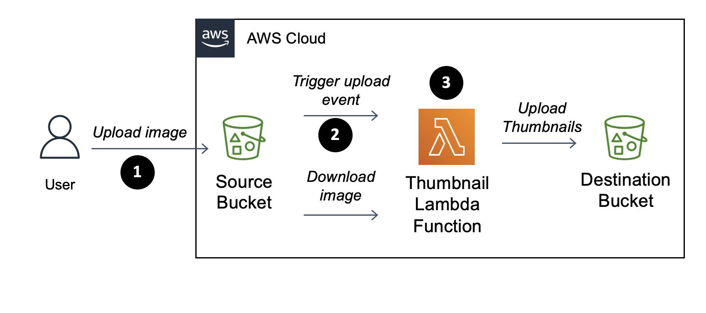
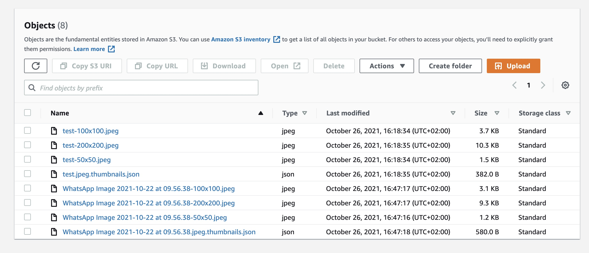

## Creating a serverless thumbnail service with AWS CDK

In this article, we build a service that automatically creates thumbnails of uploaded pictures, which can be e.g. used for a blog.

To create our service, we will use S3, the AWS file storage service, to store the pictures and thumbnails, and AWS Lambda, the AWS serverless computing service, to create the thumbnails.
When a user uploads a picture to the source S3 bucket, a lambda function will be triggered, which will execute our code to generate the thumbnails and will put it into a target bucket.



To define the cloud resources of our service within AWS, we will use AWS CDK (Cloud development kit, https://aws.amazon.com/de/cdk/), a new library to write infrastructure code. In this example we will use Typescript as our programming language of choice.

### Getting started with Amazon CDK

So what it is AWS CDK?
In a nutshell, it is a library for generating CloudFormation templates (i.e. a JSON file, which describes your infrastructure) in different languages like Typescript, Python and Java.
Important to understand is, when using CDK, the CloudFormation template is generated on our computer, so there is no AWS Service which is called "CDK".

After it has been created, the CloudFormation template is uploaded to the AWS CloudFormation service, which creates the described infrastructure in AWS (this works both for the initial creation, and also when you change a template and the resources are already in place and need to be changed, see https://docs.aws.amazon.com/AWSCloudFormation/latest/UserGuide/using-cfn-updating-stacks-changesets.html).

To get started, we need to learn about a few concepts, which are specific to CDK:

- **App:** The root construct, which is a container for one or more stacks.
- **Stack:** A stack is a unit of deployment, all resources within a stack are provisioned as a single unit. You can deploy stacks separately or altogether.
- **Construct:** The main abstraction unit/building block of a stack. A construct contains one or more logically related resources. There are L1 Constructs, which directly correspond to the resources defined by CloudFormation, and higher order Constructs, which represent one or more resource and may already contain some logic.
- **Resource:** Represents an actual "thing"/entity within AWS, e.g. an EC2 instance or a S3 bucket. Each resource is identified by a unique ARN (Amazon-Resource name).
- **Token:** Represents a value which is not known yet. For example, when we want to pass the ARN of an S3 bucket to a Lambda function, we cannot do that because the ARN is known only after the resource is actually created. So instead a token representing the ARN is passed, which will later be resolved to the actual ARN (under the hood Cloudformation References are used). Since this is a thing which is done in the background, in your code, we won't see a difference.
- **Synthesizing:** Process of executing the code, which defines the infrastructure using CDK Constructs and generating the CloudFormation template.

One could ask why even bother learning new concepts when we have our good old CloudFormation templates?
In my opinion there are few advantages when using CDK compared to writing CloudFormation templates by hand:

- **Familiar tooling and programming language concepts:** I can use my well known tools like the IDE and the tooling it provides (including code auto-completion and refactoring). I can use a programming language I am already familiar with and the CDK integrates into the provided programming languages constructs like using variables for references. I can use the package manager to use and create dependencies and known the file structure for my code.
- **No need to learn a new schema:** I do not have to learn the nitty-gritty details of a schema like CloudFormation templates to define my infrastructure, so I can focus on the "business logic", i.e. how I want to stick together my resources (of course I still need to learn the resource constructs of the AWS platform)
- **Testing:** I can unit test the code I write as I usually do, e.g. with Jest
- **Compactness and maintainability:** In my example I could define the service infrastructure in about 30 lines - it will generate a 300 line cloudformation template. I can leverage the abstraction constructs my language provides me and this helps me to define everything with more compact code, which also makes everything more maintainable.
- **Fun:** Last but not least, It's just more fun playing and sticking together the different services and getting instant feedback via compile time / IDE provided type-checks, than to mess around with a 300 line YAML file

## Let's get started

To follow this example you will need an AWS account, have the AWS CLI configured and installed the AWS CDK via `npm install -g aws-cdk`.
Clone the repository from `https://github.com/lukstei/thumbnail-service-cdk`.

We will go through each important file, and explain the interesting parts on the way.
The first file we look into is `bin/cdk-lambda.ts`:

```
#!/usr/bin/env node
import 'source-map-support/register';
import * as cdk from '@aws-cdk/core';
import { CdkThumbnailServiceStack } from '../lib/CdkThumbnailServiceStack';

const app = new cdk.App();
new CdkThumbnailServiceStack(app, 'CdkThumbnailServiceStack', {
    tags: {
        app: "thumbnail-service",
        env: "dev"
    }
});
```

This defines the entry point of our stack. The CDK will execute this file, and all defined constructs in our stack contains to generate the CloudFormation template.

In our case we only defined one stack `CdkThumbnailServiceStack`, for which we pass some tags in order to stay organized. AWS resources can be tagged to categorize resources. When we define a tag for a stack it will get applied to all resources the stack creates.

Next, let's look into the `CdkThumbnailServiceStack`, which is located in `lib-cdk-lambda-stack.ts`:

```
import * as cdk from '@aws-cdk/core';
import { CfnOutput } from "@aws-cdk/core";
import { ThumbnailingBucket } from "./ThumbnailingBucket";

export class CdkThumbnailServiceStack extends cdk.Stack {
    constructor(scope: cdk.Construct, id: string, props?: cdk.StackProps) {
        super(scope, id, props);

        const thumbnailer = new ThumbnailingBucket(this, "Thumbnailer", {
            name: "lukstei-pictures2"
        });

        new CfnOutput(this, "SourceBucketUrl", {
            description: "Source Bucket",
            value: `https://s3.console.aws.amazon.com/s3/buckets/${thumbnailer.sourceBucket.bucketName}`
        })
        new CfnOutput(this, "DestBucketUrl", {
            description: "Destination Bucket",
            value: `https://s3.console.aws.amazon.com/s3/buckets/${thumbnailer.destBucket.bucketName}`
        })
        new CfnOutput(this, "LambdaOut", {
            description: "Lambda ARN",
            value: thumbnailer.func.functionArn
        })
    }
}
```

The `CdkThumbnailServiceStack` class defines four constructs: our `ThumbnailingBucket`, which contains our main "logic", and the outputs, which are used to output some values after the resources are created.


Here we see an interesting thing: in line XXX We are using `thumbnailer.func.functionArn` to reference ARN of the Bucket, however, when our stack class is executed in the synthesizing step, the ARN is not yet known, since the resource is not yet created.

So how does that work? The answer is, the CDK uses so-called tokens to represent values, which are not yet known. When we, for example, try to print out the `thumbnailer.func.functionArn` we will see something like `${Token[TOKEN.220]}`, which is how the tokens are represented internally. The nice thing about this concept is you can pass tokens around as is the actual value was there.

When we look at the generated CloudFormation template, we see that our token was rendered as an intrinsic function, which will grab the ARN value of the referenced bucket:

```
// ...
"LambdaOut": {
  "Description": "Bucket ARN",
  "Value": {
    "Fn::GetAtt": [
      "ThumbnailerresizerD404C058",
      "Arn"
    ]
  }
}
// ...
```

The nice thing about that is, that we don't even have to understand how it works internally, we can just use the value just as if it was actually present. It is even possible to do string concatenation with tokens, e.g. `thumbnailer.func.functionArn + " a string"` which would render correctly.

Since there is not much more interesting to see in `CdkThumbnailServiceStack` let's look into the `ThumbnailingBucket` construct, which is located in `lib/ThumbnailingBucket.ts`:

```
// ...
export class ThumbnailingBucket extends Construct {
   // ...

   constructor(scope: Construct, id: string, props: ThumbnailingBucketProps = {}) {
        super(scope, id);

        this.sourceBucket = new s3.Bucket(this, 'sourceBucket', {
            bucketName: props.name,
            removalPolicy: RemovalPolicy.DESTROY
        });
        this.destBucket = new s3.Bucket(this, 'destBucket', {
            bucketName: `${this.sourceBucket.bucketName}-thumbs`,
            removalPolicy: RemovalPolicy.DESTROY
        });
```

We define our source and destination S3 buckets.

```
        this.func = new lambda_node.NodejsFunction(this, 'resizer', {
            bundling: {
                forceDockerBundling: true,
                nodeModules: ['sharp'],
            },
            timeout: Duration.minutes(1),
            memorySize: 256,
            functionName: `${props.name}-resizer`,
            runtime: lambda.Runtime.NODEJS_14_X,
            environment: {
                DEST_BUCKET: this.destBucket.bucketName
            },
        });
```

We define our lambda function.

Here we are using a special construct named `NodejsFunction`, which automatically bundles the specified JS/TS file plus their dependencies into a `.zip` file, as required by Lambda. This has the advantage that we can define the lambda code in the same package as the CDK code. If this is not wanted we could use the <a href="https://docs.aws.amazon.com/cdk/api/latest/docs/aws-lambda-readme.html#aws-lambda-construct-library" target="_blank">vanilla Lambda `Function` construct</a>.

The source code of the lambda function is located in `lib/ThumbnailingBucket.resizer.ts`. The details of the lambda code aren't that interesting. On a high level it to download the file which is passed to our Lambda handler by the S3 notification trigger. Then generating thumbnails using the `sharp` library and then uploading the generated files to the destination bucket.

In bundling we specify `forceDockerBundling` because our code depends on a library which uses native dependencies. When we prepare the Lambda `.zip`, which contains our lambda code + dependencies, and we are using a Mac machine it would not work because the Node Package Manager will only download the Mac binaries, however the Lambda is executed on a Linux machine. So we can prepare the `.zip` inside a docker container, which uses the same environment as Lambda and therefore will download the correct binaries.

In `environment` we pass the destination bucket name as a parameter, since it is not known beforehand. We could also pass tokens for unknown values here.

```
        [".jpg", ".jpeg", ".png"].forEach(suffix =>
            this.sourceBucket.addObjectCreatedNotification(
                new s3notify.LambdaDestination(this.func), { suffix: suffix }));
```

We set up notification triggers, which will call our lambda function when pictures are uploaded.

As we see it is possible to loop over an array and execute some CDK logic on it, as we would also in "normal" code do.

For all resource references we can just use normal variables, e.g. for the `LambdaDestination` we can pass the Lambda construct we created above. It would also be possible to reference already existing resources, e.g. for Lambdas with `const myExistingLambda = lambda.Function.fromFunctionArn("arn:aws:lambda:region:account-id:function:function-name")`

```
        this.sourceBucket.grantRead(this.func);
        this.destBucket.grantWrite(this.func);
```

The last thing we do is to grant the lambda function permissions to read from the source bucket and to grant write permissions to the destination bucket.
We can see it's pretty easy to work with IAM permissions in CDK because we can use variables to reference resources and also use builtin logic like the `grantRead` method, which already "knows" which actions to grant.

The generated service role policy statement for the source bucket looks as expected:

```
"PolicyDocument": {
    "Version": "2012-10-17",
    "Statement": [{
        "Action": [ "s3:GetObject*", "s3:GetBucket*", "s3:List*" ],
        "Effect": "Allow",
        "Resource": [ /* our source bucket */ ]
    }]
}
```

### Deploying our stack

We can run the synthetization with `cdk synth` to see the generated CloudFormation template.
To deploy our stack we can run `cdk deploy`.
After it's deployed we can put a test image into the source bucket and see the generated thumbnails in the destination bucket.



### Testing our stack

We can unit-test our constructs just as any other code we normally write, e.g. with Jest.

In `test/ThumbnailingBucket.test.ts` we unit-test our construct:

```
import { Stack } from '@aws-cdk/core';
import { ThumbnailingBucket } from "../lib/ThumbnailingBucket";
import '@aws-cdk/assert/jest';
import { SynthUtils } from "@aws-cdk/assert";

describe('ThumbnailingBucket', () => {
    const stack = new Stack();
    new ThumbnailingBucket(stack, 'Subject', {
        name: "blog-pictures"
    });
    it("defines exactly two buckets", () => {
        expect(stack).toCountResources('AWS::S3::Bucket', 2);
    });
    it("defines exactly two buckets", () => {
        expect(stack).toCountResources('AWS::Lambda::Function', 1+1); // 1 is implicitly created by the notification handler
    });
    it("sets the correct policies", () => {
        expect(SynthUtils.subset(stack, {resourceTypes: ["AWS::IAM::Policy"]})).toMatchSnapshot();
    });
});
```

It's possible to use special assertions for the generated template, e.g. `toCountResources`.

Snapshot testing is also supported, e.g. we snapshot the generated IAM policies, to ensure they won't change without noticing.

One shortcoming of the snapshots is, that the generated template contains synthetic values, which depend on the order of the construct. When we move the of `grantWrite` call before the `grantRead` call, this will still generate a semantically equivalent policy, however the snapshot will fail because the synthetic id's changed. As of now, I didn't find a better way to generate the snapshots, maybe this will change in the future.

## Conclusion

// todo
In this article we created a serverless thumbnail service using the AWS CDK. We were able to leverage our 